# Course OTUS PHP_2022, DZ for Lesson #13: "Redis"

## Author
Mikhail Ikonnikov , mishaikon@gmail.com

## A task

### Target
Learn how to interact with Redis.

### Description/step-by-step instructions for completing homework

The analyst wants to have a system with the following capabilities:
- The system must store events that will later be sent to the event service
- Events are characterized by importance (the analyst is ready to set the importance in integers)
- Events are characterized by occurrence criteria.
- The event occurs only if all the criteria for its occurrence are met.
- For simplicity, all criteria are set as follows:
```
<criteria>=<value>
```
- Thus, suppose that the analyst enters the following events into the system:
```
{ priority: 1000, conditions: { param1 = 1 }, event: { ::event:: }, },
{ priority: 2000, conditions: { param1 = 2, param2 = 2 }, event: { ::event:: }, },
{ priority: 3000, conditions: { param1 = 1, param2 = 2 }, event: { ::event:: }, },
```
- A request comes from the user:
```
{ params: { param1 = 1, param2 = 2 } }
```
- The first and third entries match this request, because both of them fulfill all the conditions
  but the third one has more priority, since it has a higher priority.

### Required
Write a system that will be able to:
- add a new event to the event storage system
- clear all available events
- respond to the user's request with the most appropriate event
- use to store redis events

### Criteria for evaluation
- It is advisable to practice in parallel and perform remote sensing in other NoSQL storages
- The layer of code responsible for working with the repository should allow you to easily change the repository

------------------------------------------------

### Installation
- source code checkout
```
git clone https://github.com/otusteamedu/PHP_2022.git
cd PHP_2022
git checkout Mikonnikov_hw13

# setup redis/memcached extensions (if required)
apt-get install php-redis
apt-get install php-memcached

# setup for tests
apt install php-xml
apt install phpunit
apt install php curl

# enable php extensions:
# uncomment in php.ini (in my case: /etc/php/8.1/cli/php.ini)
extension = curl
extension=memcached
extension = redis

# download/update vendor libs
composer update
```
- rename file ```.env.example``` to file ```.env```
- execute:
  ```docker-compose build```
- when the assembly is completed, execute:
  ```docker-compose up -d```
  (containers will be created)

### Setting
- go into the container ```otus-hw11``` execute ```chmod +x analytics_panel.php```
- Available to work with two NoSQL databases - ```Memcached``` and ```Redis```.
- Switching is done by changing the value of the ```repository``` parameter
- in config. file ```app\src\config\common.php```

### Autotests
Go to the /test folder and run the API auto-tests:
```
cd test
phpunitApptest.php
```
All tests should pass successfully.
Below is a description of how to perform manual testing.

### Interaction with the system through the console
- Work with the system is possible through ```HTTP API``` and ```Cli API```
- To work via the command line, you need to go to the container ```otus-hw11```:
```
docker exec -it otus-hw11 bash
```
- and execute ```./analytics_panel.php```.
- Then just select the items offered by the system
  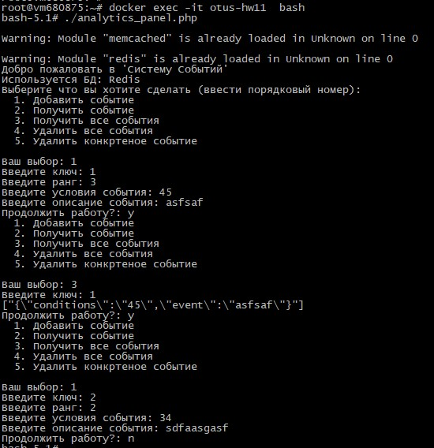

### Interaction with the system via API
(*) I recommend using [Postman](https://www.postman.com/downloads/).

To work through the ```HTTP API```, the following ```url``` are provided:
- ```/api/event/add``` - adding an event: ```{"key":"event", "score":1000, "conditions":"param=1,param=2", " event_description":"event1"}```
- ```/api/event/get``` - get a specific event: ```{"key":"event", "conditions":"param=1,param=2", "event_description":"event1 "}```
- ```/api/event/get_all``` - get all added events: ```{"key":"event"}```
- ```/api/event/delete``` - delete a specific event: ```{"key":"event", "conditions":"param=1,param=2", "event_description":"event1 "}```
- ```/api/event/delete_all``` - delete all events: ```{"key":"event"}```
- All requests and responses from ```HTTP API``` in ```JSON```
- The result of searching and deleting will always be an event that matches the given search conditions, but with the maximum rank (```score```)
  (*) Testing example via Postman:
  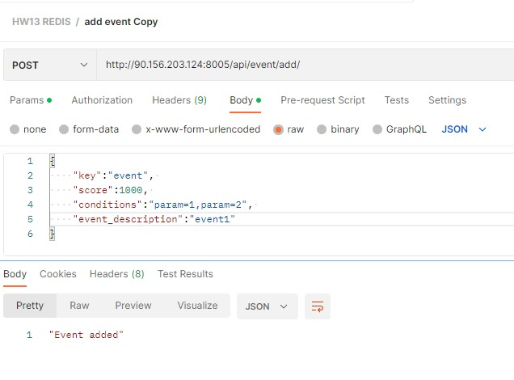

(!) For testing, you can also use the online test site:
http://90.156.203.124:8005/

### Examples of working through a console application
- Start:
  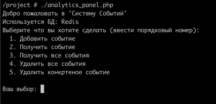
- No events:
  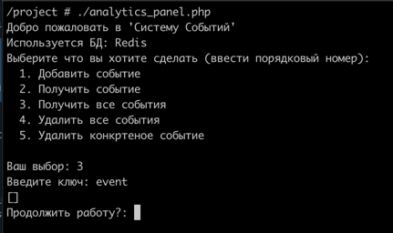
- Let's start adding:
  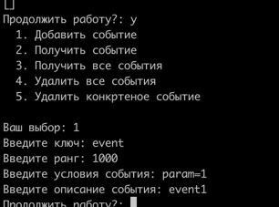
- We continue:
  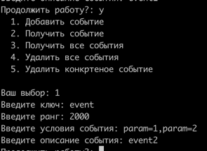
  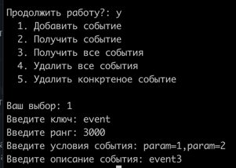
- Check that events are added:
  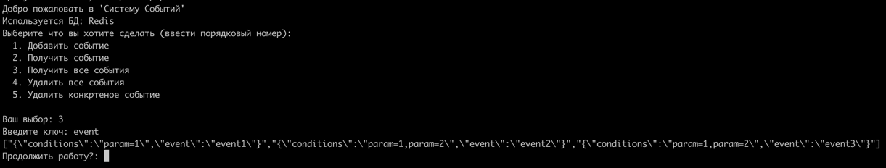
- Get the event:
  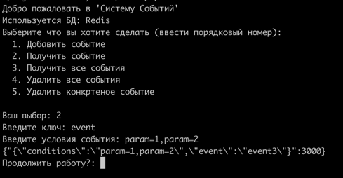
  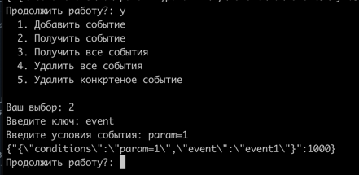
- Remove the second event:
  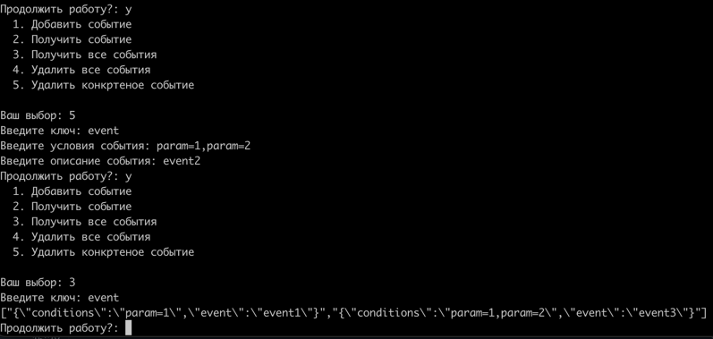
