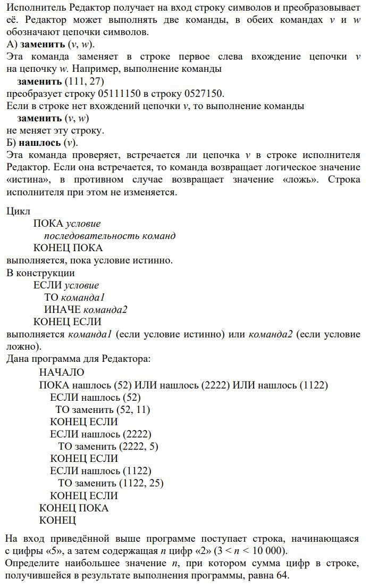
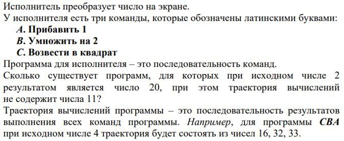

### Что это?

Задачки с тестирования кандидатов по логике. 
Решим каждую по отдельности.

### Задача 1

```bash
php ./find_n.php
```

### Задача 2


Решение:
```bash
php ./find_programs.php
```

### Подбронее
- Разбор задачек тут: http://nujensait.ru/11259/

### Автор решения
- ChatGPT 4о